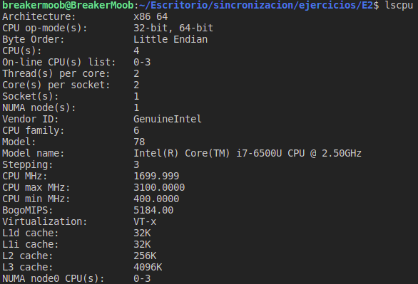
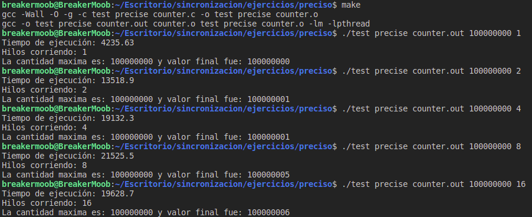
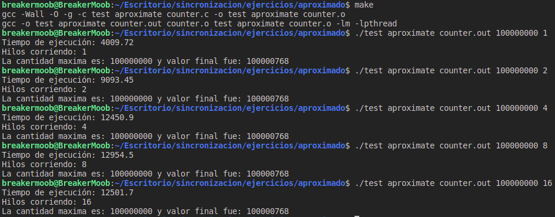
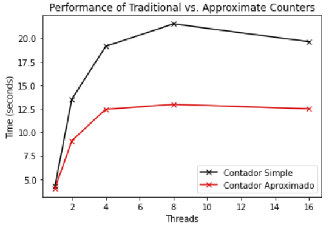
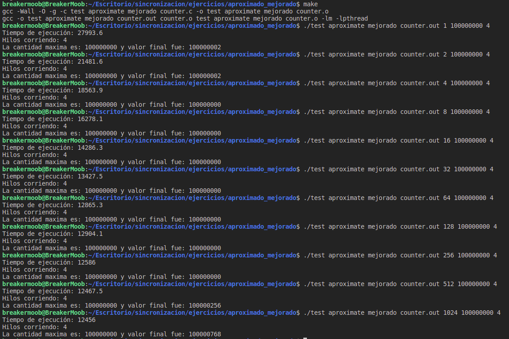
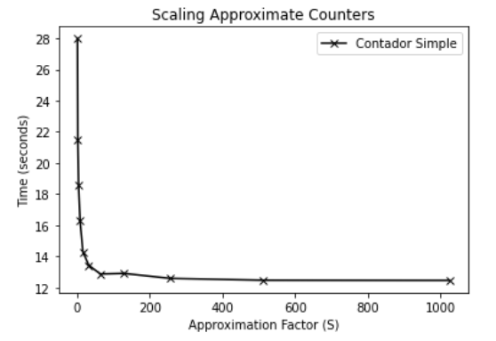

# Manejo de estructuras que usan locks #

## Fuentes de consulta ##
1. Material de clase (Videos y diapostivas).
2. Texto guía [**Operating Systems: Three Easy Pieces**](http://pages.cs.wisc.edu/~remzi/OSTEP/). Para desarrollar este laboratorio se recomienda tener a la mano el capítulo [Lock-based Concurrent Data Structures](http://pages.cs.wisc.edu/~remzi/OSTEP/threads-locks-usage.pdf)

## Ejercicios ##

1. Consulte el uso de la función ```gettimeofday``` para medir el tiempo de ejecución de un programa
   * ¿Cómo se utiliza esta función (muestre un ejemplo)?
   * **R:** El ejemplo se encuentra en el directorio E1 main.c 
   * ¿Cuál es el intervalo de tiempo más corto que se puede medir con esta función?
   
   * **R:** Como podemos ver en la imagen el tiempo mas corto es 0, esto nos pone a pensar que tal vez la maquina en la cual estamos ejecutando este código es mucho mejor que la función, por lo cuál esa no esta en condiciones de medir el tiempo de ejecución.
2. Consulte cuantas CPUs hay disponibles en el sistema que usted está utilizando. (Pista use el comando lscpu)
   * **R:** Como podemos ver en la siguiente figura, el número de CPUs es **4**
   
3. Desarrolle un programa que utilice un contador concurrente simple. Mida cuánto tiempo lleva incrementar el contador muchas veces a medida que aumenta el número de hilos (1, 2, 4, 8 y 16). Para tal fin, siga las instrucciones que aparecen en el directorio [preciso](./preciso). Una vez complete los pasos continue con el tercer punto.
   * **R:**
   
4. Desarrolle una versión del contador aproximado (*sloppy counter*) y mida su desempeño a medida que se varía el número de hilos. En este caso, solo maneje un umbral de S = 1024 variando el número de hilos (1, 2, 4, 8 y 16). Las intrucciones para ello se encuentran en el directorio [aproximado](./aproximado).
   * **R:** 
   
5. Grafique los resultados obtenidos de las pruebas recopiladas (en las tablas) para el **número de hilos .vs. el tiempo (en segundos)**, estas siguen la tendencia de la figura **29.5** del libro (la cual se muestra a continuación):


   * ¿Los valores que usted obtuvo siguen una tendencia como la que se muestra en el texto guía (mostrada anteriormente)?
   * **R:** En el caso del contador simple podemos ver una tendencia de aumento, pero el contador aproximado se comporta de forma muy dierente, dado que si tiempo de ejecución no tiende a cero. 
   
   * ¿Cuántas CPUs hay disponibles en el sistema que usted está utilizando?  
   * **R:** Como vimos en el punto número 2 hay 4 CPUs, pero es el sistema operativo quien sabe si las utiliza, lo mas seguro es que si se esten utilizando las 4 para correr los hilos, dado que hay pocos procesos importantes en ejecición. 
   * ¿Este número afecta de alguna manera sus mediciones?
   * **R:** Si, realizando algunas pruebas podemos notar que el tiempo de ejecución es muy variable y el número de CPUs influye en esto.
   

6. Mejore el archivo [test_aproximate_mejorado_counter.c](./aproximado_mejorado/test_aproximate_mejorado_counter.c) (el cual se encuentra en el directorio [aproximado_mejorado](./aproximado_mejorado)) de tal modo que, además de permitir modificar el numero de hilos y el valor máximo del contador a emplear, permita modificar también el umbral o factor de apromación (S), para esto se puede basar en el ejercicio 3. De este modo los parametros serán:
   * Umbral: ```APPROXIMATION_FACTOR```
   * Valor máximo del contador: ```MAXCNT```
   * Número de hilos que serán lanzados: ```NUMTHREADS```
   
Según lo anterior, la forma de pasar argumentos a la aplicación será la siguiente, una vez esté completamente terminada:  

```
./NOMBRE_EJECUTABLE <APPROXIMATION_FACTOR> <MAXCNT> <NUMTHREADS>
```

Luego, ejecute varias veces la aplicación dejando constante el valor máximo del contador en 10000000 y el número de hilos en 4, pero cambiando el valor del umbral a los siguientes valores: 1, 2, 4, 8, 16, 32, 64, 128, 256, 512 y 1024. ¿La gráfica sigue una tendencia similar a la mostrada en la figura **29.6** del texto guía (la cual se muestra a continuación)?

 * **R:** 





**R:** La gráfica tiene una tendencia de caída, pero en nuestro caso es mucho mas pronunciada.
